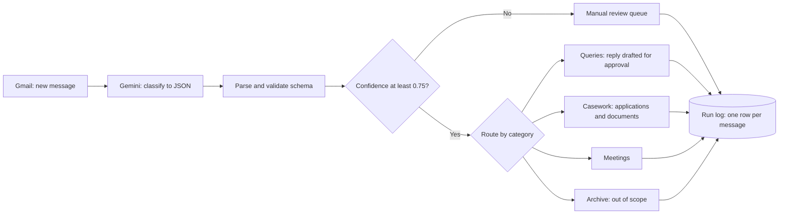

# Program Inbox Triage

AI classification, routing, and reply drafting for the shared inbox of a government incentive program. Built in **Make** with **Gemini**, **Gmail**, and **Google Sheets**.

Capstone project, TripleTen AI Automation program, August 2026. The workflow runs on a synthetic inbox and was evaluated against a labeled test set; it has not been deployed in production.

## The problem

A program team receives a steady stream of mixed email: eligibility questions, application packs, status chasers, missing documents, meeting requests, and vendor pitches. Staff open each message, decide what it is, decide who owns it, log it, and write a reply. Most of it is routine, but routing is slow, logging is inconsistent, and a hastily written reply can overstate what an applicant is entitled to.

## What the workflow does

1. Watches the inbox and sends each new message to Gemini with a closed six-category taxonomy.
2. Receives structured JSON back (category, confidence, extracted fields, and a one-sentence reason) and validates it against a schema.
3. Holds any message below **0.75 confidence** for a human instead of guessing.
4. Routes everything else to one of four destinations and records every message in a run log.
5. Drafts replies for routine questions and sends them to staff **for approval**. Nothing is ever sent to an applicant automatically.

## Taxonomy

| Category | Meaning |
|---|---|
| `ELIGIBILITY_QUERY` | Asking whether a project, property, or type of work qualifies |
| `APPLICATION_SUBMISSION` | Submitting a new application, cost build-up, or supporting pack |
| `STATUS_REQUEST` | Chasing progress on an application already submitted |
| `DOCUMENT_DEFICIENCY` | Supplying documents that were previously requested |
| `MEETING_REQUEST` | Requesting a call, site visit, or meeting |
| `OUT_OF_SCOPE` | Vendor pitch, marketing, spam, or a matter for another department |

The model selects from this list; it cannot invent a category. That is what makes accuracy measurable at all.

## Results

Evaluated on 40 labeled messages (`evaluation/testset_40.csv`), including 16 planted edge cases: vendor pitches disguised as questions, one-word messages, multi-intent emails, escalation language with deadlines, replies inside existing threads, and a bilingual Arabic and English message.

| Metric | Result |
|---|---|
| Category accuracy | **97.5%** (39 of 40) |
| Urgency accuracy | **100%** |
| Routing accuracy | **100%** |
| Edge cases handled correctly | **15 of 16** |
| Model cost | **$0.075** for the full run, about **$1.88 per 1,000 messages** |
| Tokens | 43,951 input, 11,231 output |

**The one miss, and what it taught me.** Message M14 has a one-word body ("Attached."). The model labeled it `DOCUMENT_DEFICIENCY` at 0.9 confidence; the gold label is `APPLICATION_SUBMISSION`. Routing still held, because both categories go to the same casework queue. The more important finding is that the confidence gate never fired on this set: the model reported high confidence even on messages written to be ambiguous. Self-reported confidence is not a calibrated probability, so the gate is a backstop. The primary safeguard is structural: routing is designed so that the likeliest confusions land in the same place.

**The one miss, and what it taught me.** Message M14 has a one-word body ("Attached."). The model labeled it `DOCUMENT_DEFICIENCY` at 0.9 confidence; the gold label is `APPLICATION_SUBMISSION`. Routing still held, because both categories go to the same casework queue. The more important finding is that the confidence gate never fired on this set: the model reported high confidence even on messages written to be ambiguous. Self-reported confidence is not a calibrated probability, so the gate is a backstop. The primary safeguard is structural: routing is designed so that the likeliest confusions land in the same place.

## Governance built into the design

- **No automatic sends.** Replies go to staff as drafts for approval.
- **The drafting model is caged.** It is barred from stating eligibility, quoting a percentage, confirming a tier, or promising an outcome.
- **The drafting model sees less.** It receives only the decided category and the extracted fields, never the raw email or the routing logic, so it cannot re-litigate a decision it did not make.
- **Extraction discipline.** The classifier is told to return `null` rather than infer an organization, reference number, or date that is not in the text.
- **Every decision is explained and logged.** Each classification carries a `reason`, and every message writes one row to the run log, which is where every number above comes from.
- **Failures go to a human.** API errors are re-queued rather than silently dropped.

## Build lessons

- **Trust the destination, not the canvas.** Make can show a green run that wrote the wrong thing. Verification came from the sheet rows, the field specifications, and the API error bodies.
- **Documentation can be wrong.** Make's documentation named the Gmail trigger module incorrectly; the real identifier came from an exported blueprint.
- **Canvas edits can break wiring invisibly.** One "fix" in the editor silently orphaned 15 module mappings while the canvas still drew them as connected. Scenarios are now built by authoring blueprint JSON and importing it.
mporting it.
- **Models change under you.** Gemini 2.5 Flash closed to new projects mid-build. The migration to Gemini 3.6 Flash rejected a thinking-budget setting and deprecated temperature controls, so repeatability now lives in the prompt contract rather than in sampling parameters.
- **Platform cost dominates model cost.** At this volume, Make operations cost far more than Gemini tokens, which changes where optimization effort should go.

## Stack

Make · Gemini API (Google AI Studio) · Gmail · Google Sheets · JSON Schema

## Repository contents

| Path | Contents |
|---|---|
| `evaluation/testset_40.csv` | The 40-message labeled test set with edge-case notes. All senders and organizations are fictional. |
